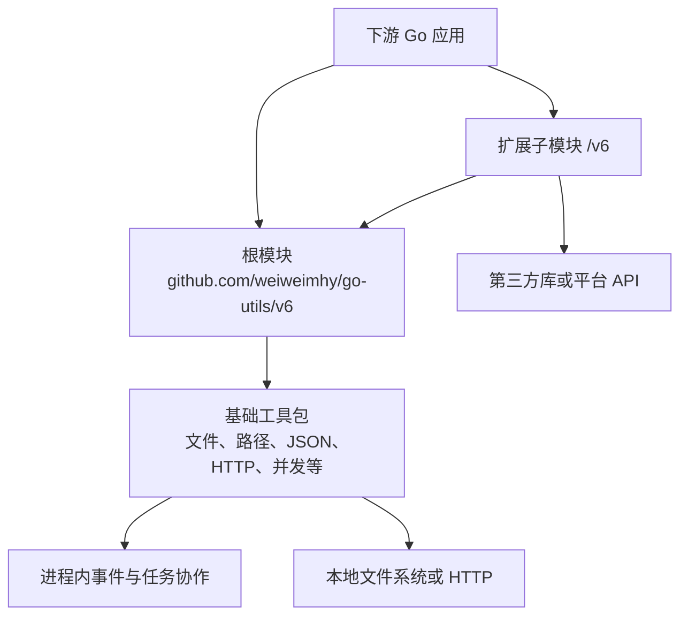

# 架构

## 系统边界

本仓库发布可被其他 Go 项目导入的工具包，而不是提供 HTTP 服务、命令行程序或单一
进程应用。主版本已体现在所有公开模块路径的 `/v6` 后缀中。根模块专注于低副作用、
标准库优先的通用能力；需要第三方依赖或外部平台语义的能力被隔离在独立子模块。

箭头 `E → R` 只代表部分扩展子模块对根模块的明确依赖；根模块不得反向导入子模块。
扩展子模块之间也不因方便而互相耦合。

## 模块职责

| 边界 | 实际职责 | 依赖策略 |
| :--- | :--- | :--- |
| 根模块 | 文件、路径、JSON、文本、ID、时间、重试、HTTP、事件、任务与安全小工具 | 仅标准库与同根模块包 |
| `download` | 并发下载管理 | 使用根模块 |
| `epub` | EPUB 读取与 HTML 重写 | 独立模块 |
| `htmlutil` | HTML 文本提取 | 使用 `golang.org/x/net/html` |
| `jwt` | HMAC/RSA 令牌生成、验证与刷新 | 使用 `github.com/golang-jwt/jwt/v5` |
| `localdb` | BBolt 本地键值存储 | 使用根模块与 BBolt |
| `logger` | zap 与 lumberjack 日志辅助 | 使用 zap 与 lumberjack |
| `mongo` | MongoDB 客户端包装 | 使用 MongoDB Go Driver |
| `tencentocr` | 腾讯云 OCR API 包装 | 使用腾讯云 SDK |
| `wechat` | 微信小程序 session API 辅助 | 使用根模块 |

`go.work` 将根模块与上述九个子模块置于同一开发工作区。每个模块单独拥有
`go.mod`；依赖、测试和发布兼容性要以模块为单位判断，而不是将仓库误当作单模块。

## 包与依赖规则

- 每个目录提供一个职责清晰的包。根模块包可以使用其他根模块包，不能形成导入环。
- 新的纯通用能力优先留在根模块；只有第三方依赖、重量级运行时或平台专属语义已经
  成为稳定需求时，才放入扩展子模块。
- 工具库提供机制，不承载调用方的领域校验、持久化事实来源或业务重试策略。
- 公共 API 的导入路径、错误语义、默认值和资源生命周期是兼容性契约。破坏性变更须在
  对应 v6 模块中审查其发布影响。

## 关键运行流

调用方通过公开函数、构造器和 `Options` 传入数据、上下文与可选依赖。可阻塞的文件、
网络、重试和任务链路传播 `context.Context`；包返回数据或可判断的错误给调用方，
不在通用库中擅自输出日志。`event.Bus` 是进程内的订阅与调度机制，不是消息中间件；
其 `Close` 会停止接收新工作并等待已接收队列排空。

本仓库不定义集中式数据库、HTTP 路由、认证服务或数据迁移。`localdb`、`mongo` 与
各平台子模块只是可选客户端能力，数据所有权和业务协议仍归使用这些包的下游项目。
